# Humanoid Olympics

| | | |
|---|---|---|
| 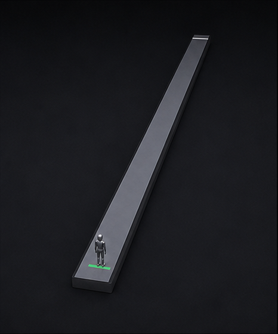<br>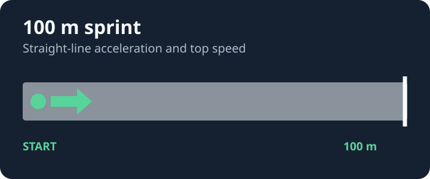 | 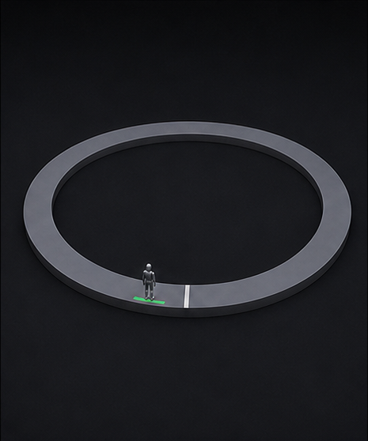<br>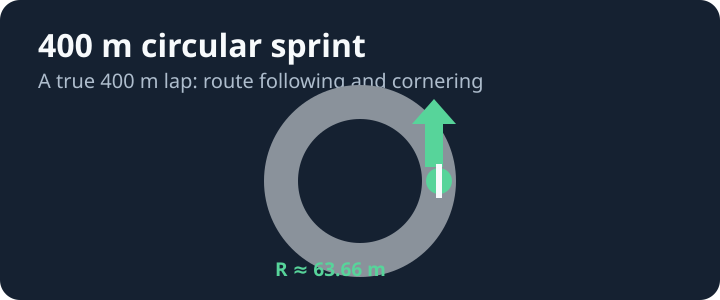 | 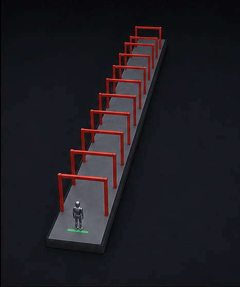<br>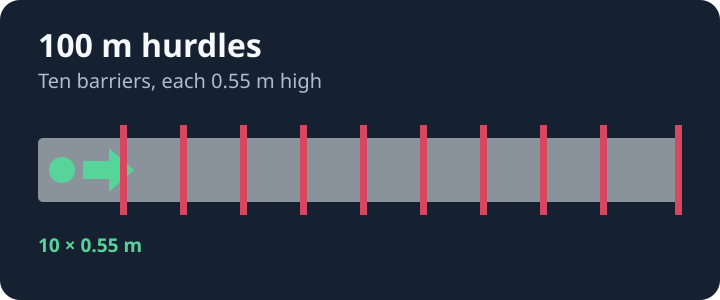 |
| 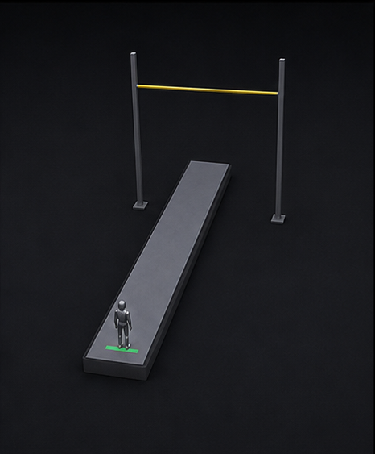<br>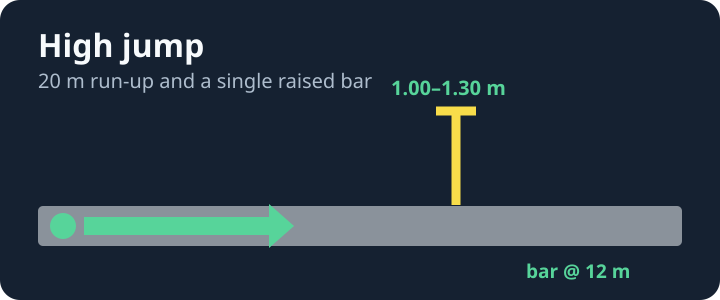 | 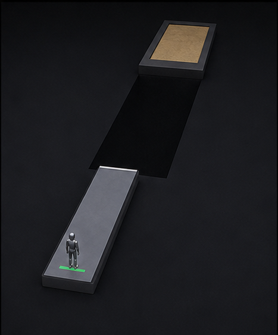<br>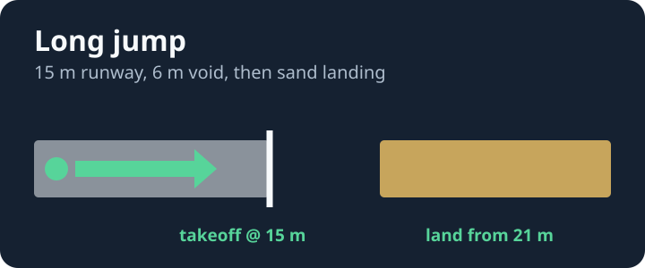 | 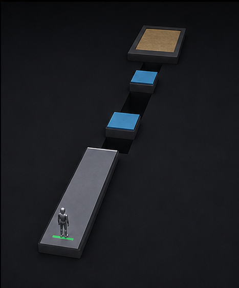<br>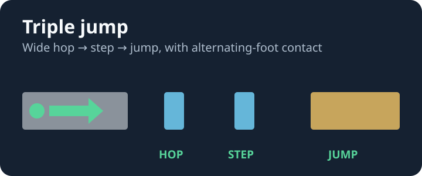 |

Train one legs-only Unitree G1 controller to compete across a balanced six-event athletics meet.
Each evaluation contains the same number of attempts of every discipline, and the leaderboard
score is their equal-weight mean. The aim is a fast, adaptive, all-round humanoid athlete — not
a policy specialised to one obstacle.

The initial course preset is deliberately severe: a 24 s 100 m, 72 s circular 400 m, ten 0.70 m
hurdles, 1.00–1.30 m high bars, a 6 m long-jump void, and wide legal triple-jump phases. A first
complete all-round performance is intended to be a meaningful breakthrough.

| Discipline | Skill tested |
|---|---|
| 100 m sprint | straight-line acceleration and top speed |
| 400 m circular sprint | sustained pace, local route following, and cornering |
| 100 m hurdles | high-speed repeated clearance |
| high jump | a clean vertical clearance and crossing |
| long jump | approach, take-off, flight, and safe landing |
| triple jump | an ordered hop, step, and final landing |

The robot has twelve actuated leg joints. Its arms and upper body are physical mass and collision
geometry, but are not actuated; throwing events and pole vault intentionally belong in a future
competition.

## Scoring

Every discipline returns a bounded score from 0 to 1. A completed attempt scores from 0.25 upward;
an incomplete attempt remains below 0.25. Faster legal race finishes, higher cleared bars, and
longer valid horizontal jumps earn more. Limited progress credit remains useful for local training
without outweighing a complete attempt.

The round result is:

```
raw_score = mean(event_mean[100m, 400m, hurdles, high jump, long jump, triple jump])
```

The referee records every event attempt in `result.json` metadata and writes a replayable history
file for it. Conditions are generated from the round seed and held fixed for all submissions in
that round.

## Policy interface

Submit one ONNX model, at most 15 MB, with exactly:

```
inputs   obs       float32 [batch, 104]
         state_in  float32 [batch, 256]
outputs  action    float32 [batch, 12]
         state_out float32 [batch, 256]
```

`action` is a vector of joint-position-target offsets, not torques. `state_in` and `state_out`
are opaque recurrent memory, reset at the start of each event attempt. The observation includes
proprioception, course-relative heading and cross-track error, a 6 m terrain scan, and overhead
clearance. Friction and wind are not observation fields; a policy must react to their effects.

The 400 m is a true circular 400 m route (radius approximately 63.66 m), not a scaled lap. Its
progress follows accumulated forward route distance, so cornering is part of the task.

## Local development

The referee image owns the simulation and score. The player image only loads and serves the ONNX
policy using the vendored `gym_v1` API.

```bash
# With mujoco, numpy, and onnxruntime installed locally:
PYTHONPATH=. python tools/make_test_policy.py --out /tmp/test.onnx
PYTHONPATH=. python tools/local_eval.py /tmp/test.onnx -n 1 --max-steps 200

# Evaluate a full four-attempt meet (24 event attempts):
PYTHONPATH=. python tools/local_eval.py baseline/baseline.onnx -n 4 --seed 1

# Inspect or film one event:
PYTHONPATH=. python tools/preview.py --event sprint_400
PYTHONPATH=. python tools/preview.py --event high_jump --attempt 2 --run baseline/baseline.onnx
```

`--max-steps` is a local debugging cap. A scored meet uses each discipline's own official cap:
1,200 steps for the 100 m (24 s), 3,600 for the 400 m (72 s), 1,900 for hurdles, and shorter
event-specific caps for jumps.

To run both production images locally:

```bash
docker build -f referee/Dockerfile -t olympics-referee .
docker build -f player/Dockerfile  -t olympics-player .
docker network create olympics-net
docker run -d --name olympics-player --network olympics-net \
  -v "$PWD/baseline/baseline.onnx:/app/submission.onnx:ro" olympics-player
mkdir -p /tmp/olympics-data && chmod 777 /tmp/olympics-data
docker run --rm --network olympics-net -v /tmp/olympics-data:/data \
  -e MATCH_ID=local -e SEED=1 -e NUM_PLAYERS=1 \
  -e PLAYER_URLS=http://olympics-player:8000 \
  -e CONFIG_JSON='{"seed":1,"instances_per_event":4,"deadline_ms":500}' \
  olympics-referee
jq '.raw_scores, .metadata.event_scores' /tmp/olympics-data/result.json
```

## Repository layout

```
env/       event geometry, shared physics, scoring, and replay history format
player/    ONNX loader and gym_v1 player server
referee/   event scheduler and scorer
baseline/  inherited G1 locomotion reference and measurement notes
tools/     local evaluation, policy export, rendering, and replay
docs/      design and calibration notes
```

Before release, the baseline must be remeasured over at least 20 round seeds on native amd64
hardware, and the released player/referee image digests must replace the temporary values in
`spec.yaml`.
